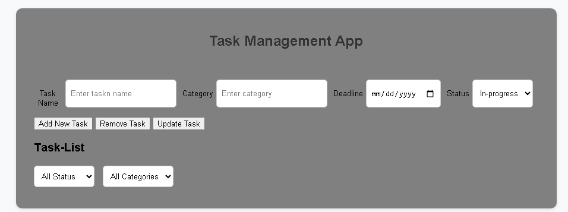

Task Management Application

A simple and responsive Task Management Application built with HTML, CSS an Javascript.  
This app allows users to add,update,delete and filter tasks easily

Features

Add Task: Enter task name, category, deadline, and status to add a new task.
Update Task: Update existing task
Delete task" Delete Task
Filter by status:  Filter only In Progress, Completed, or Overdue tasks.
Filter by category: Filter like work ,Personel

Input Field validation

Before adding a task, the app checks that:
- Task name, category, and deadline fields are not empty.  
If any are blank, an alert appears:  

How It Works

 Add a Task
   - Fill out the form fields and click Add Task.
   - If valid, the task appears in the list immediately.

View or Filter Tasks
   - Use the status dropdown to filter tasks (e.g., show only Completed).

Update 
   - Select a task, edit its details, then click Update Task.
    
Delete
    - On click Remove Task to delete it.

App files

index.html: Main HTML file
style.css:  Minimal CSS
script.js: Core app logic
README.md

Challenges

The most challenging part of the project was implementing the filter feature, as it took me the most time to get it working correctly. I also did not manage to include local storage or the overdue detection feature yet.I found it difficult to include both the filtering feature and the dropdown for adding tasks in the same section, so I decided to create a separate filter instead.

Screenshot
